# DIY WriterDecks

Here is a selection of DIY writerDecks by various people.

# Custom Built WriterDecks

If the table below looks awful, try the [mobile version](list-of-diy-writerdecks-mobile.md).

| Date | Name | Details | Image |
| ---- | ---- | ---- | ---- |
| 2/15/2026 | [etyper](https://github.com/Quackieduckie/etyper) ([Hackaday](https://hackaday.io/project/205065-etyper)) by Quackieduckie | Hardware: "Orange Pi Zero 2W, WeAct Studio 4.2" E-ink (~$40 total)"; Software: etyper custom open software; Case: 3D printed (foldable, print-in-place, no supports) | [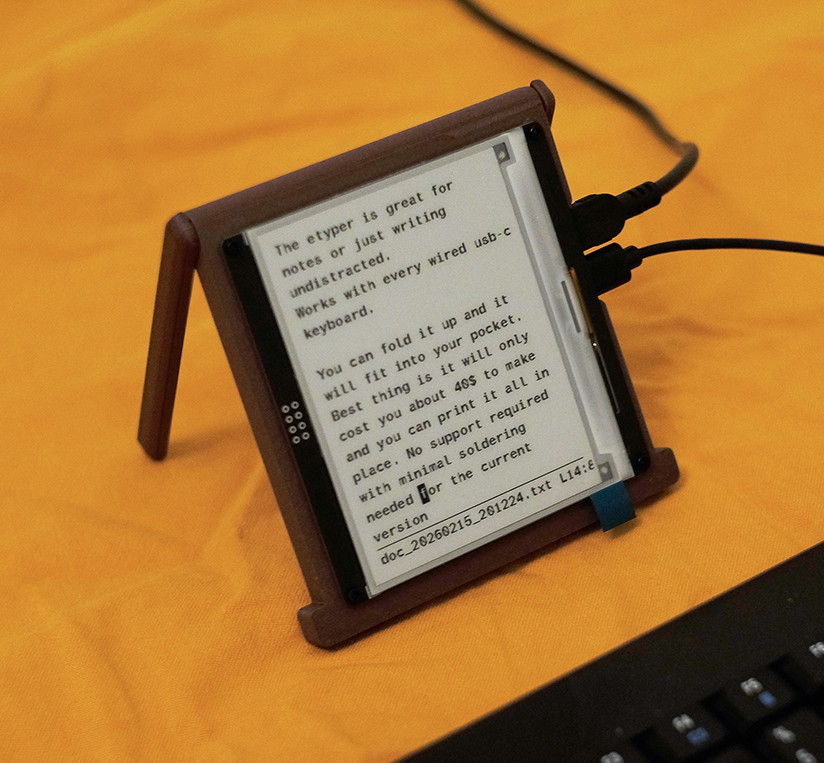](/images/diy/etyper.jpg) |
| 1/7/2026 | [Typeframe PX-88](https://www.typeframe.net/docs/px-88) by u/jeffmerrick | Hardware: "Raspberry Pi 4B; Waveshare 7.9inch DSI LCD; Case: 3D printed" | [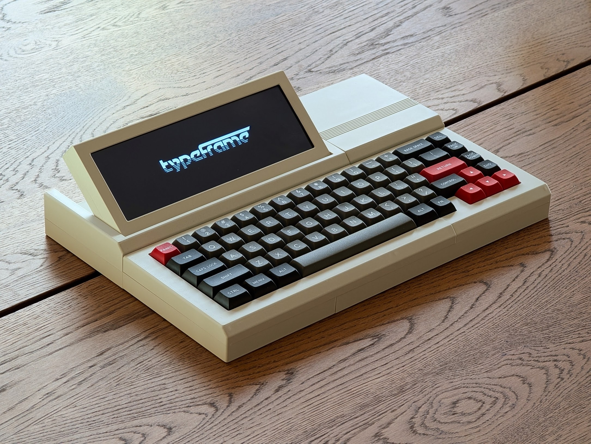](/images/diy/typeframe-px-88-01.71fdfa3.2169.jpg) |
| 8/26/2025 | [JFW](https://www.reddit.com/r/writerDeck/comments/1n0vo6o/my_jfw_writerdeck/) by u/Not_Hilary_Clinton | Hardware: "Raspberry Pi 5, SunFounder 101.1"" screen AdaFruit Trackball, Royal Kludge R65 keyboard"; Software: FocusWriter; Case: 3D printed | [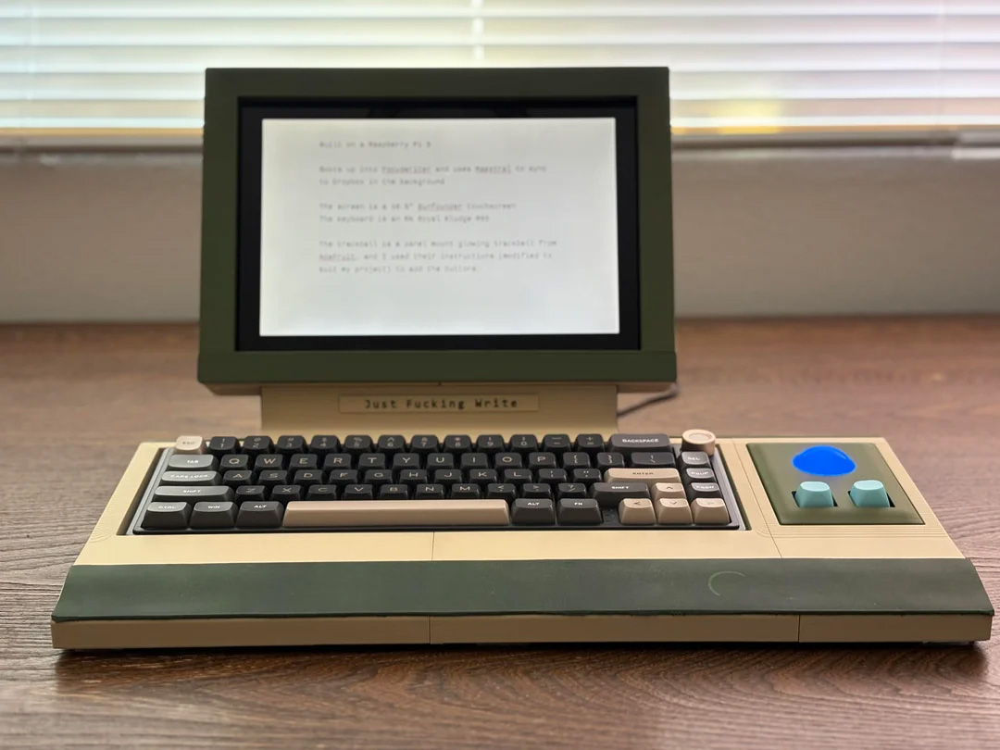](/images/diy/JFW.jpg) |
| 1/27/2025 | [Octavia](https://www.reddit.com/r/writerDeck/comments/1ibn4ny/presenting_the_octavia/) by u/jiadarola | Hardware: "iPad Mini 6, Epomaker EP64 keybaord"; Software: iPad Mini OS; Case: 3D printed | [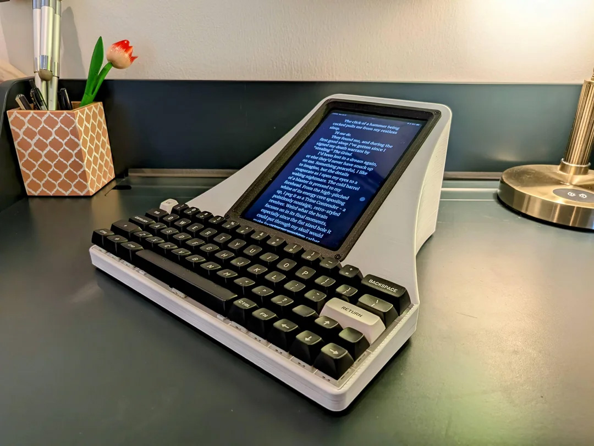](/images/diy/Octavia.jpg) |
| 1/14/2025 | [Micro Journal Rev 7](https://github.com/unkyulee/micro-journal/tree/main/micro-journal-rev-7-e-ink) by Un Kyu Lee | Hardware: "ESP32.S3, Lilygo T5 e-Paper"; Software: Custom; Case: 3D printed | [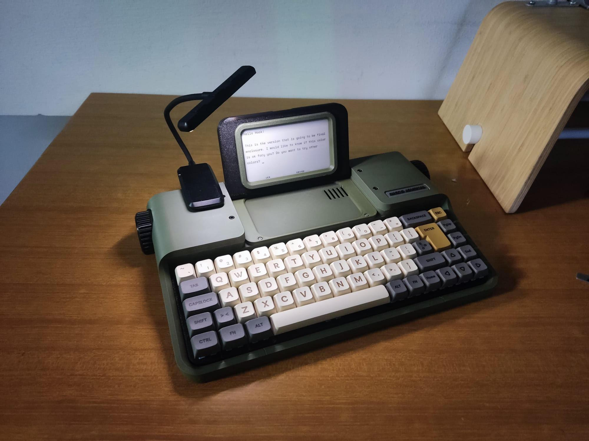](/images/diy/MicroJournalRev7.jpg) |
| 3/4/2024 | [Micro Journal](https://github.com/unkyulee/micro-journal) by Un Kyu Lee | Hardware: "Raspberryi Zero 2W, 30-key keyboard"; Software: ???; Case: 3D printed | [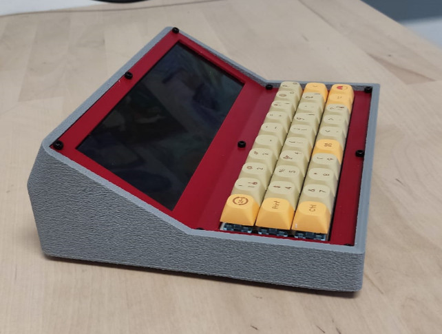](/images/diy/MicroJournal.jpg) |
| 2/25/2024 | [Tapico Typer](https://www.reddit.com/r/writerDeck/comments/1b03zy0/tapico_typer_a_calculator_but_for_words/) by u/v1c3ntecruz | Hardware: "Raspberry Pi Zero 2 W, Waveshare e-ink"; Software: ZeroWriter; Case: 3D printed | [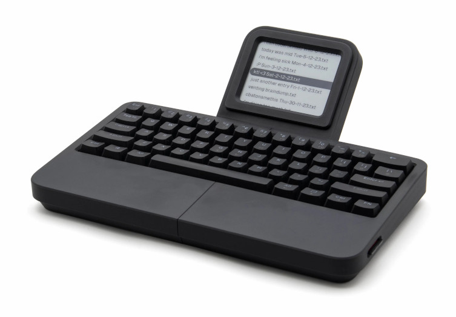](/images/diy/TapicoTyper.jpg) |
| 2/19/2024 | [backgammon deck](https://www.reddit.com/r/writerDeck/comments/1aur99n/first_attempt_work_in_progress/) by u/ChristyMalry | Hardware: "Raspberry Pi Zero 2W, Waveshare E-ink"; Software: ZeroWriter; Case: backgammon board | [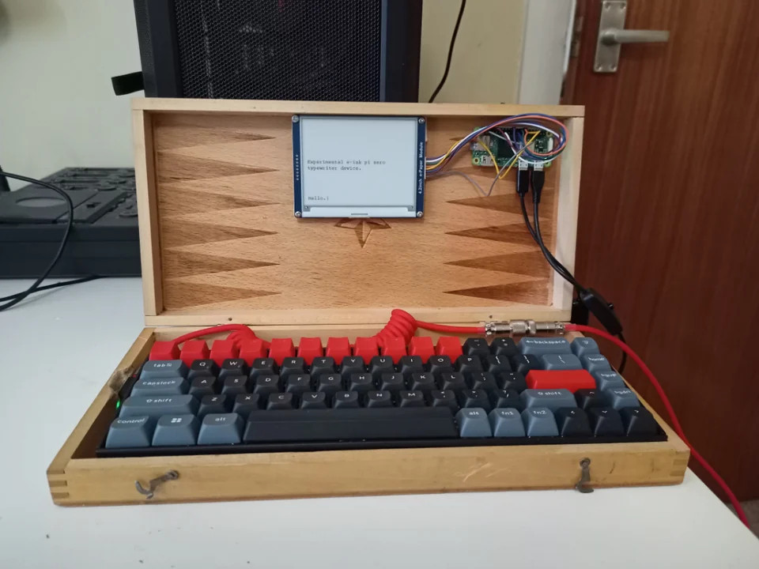](/images/diy/Backgammon.jpg) |
| 2/7/2024 | [TypeWryter](https://www.reddit.com/r/writerDeck/comments/1alauai/my_slate_writerdeck_i_call_it_my_typewryter/) by u/CertifiedWerewolf | Hardware: "Raspberry Pi Zero 2W, Waveshare E-ink"; Software: TypeWryter; Case: plastic | [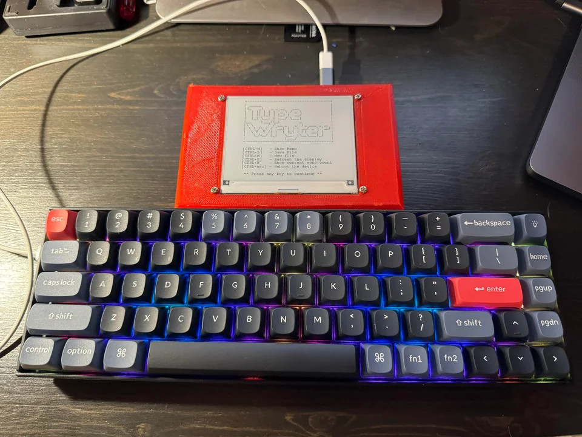](/images/diy/TypeWryter.jpg) |
| 1/19/2024 | [Creativity Machine](https://www.reddit.com/r/writerDeck/comments/19am36v/my_diy_creativity_machine/) by u/Pangolin_Beatdown | Hardware: Rapberry Pi 4b; Software: Wordgrinder; Case: "jewelry trays, vinyl" | [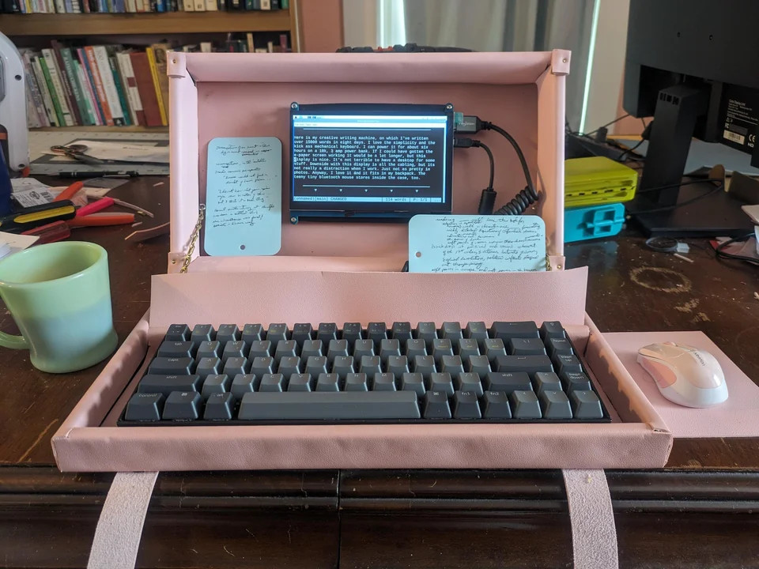](/images/diy/CreativityMachine.jpg) |
| 12/24/2023 | [Mewriter](https://www.reddit.com/r/writerDeck/comments/18pria7/the_mewriter/) by u/Cello42 | Hardware: "Rapberry Pi Zero 2W, VSDisplay IPS touchscreen"; Software: "FocusWriter, WordGrinder"; Case: wood | [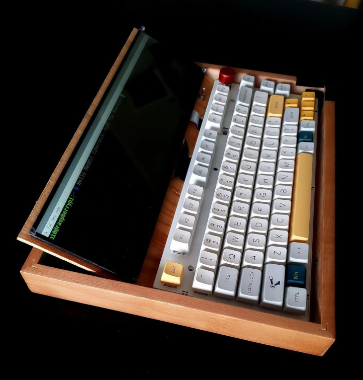](/images/diy/Mewriter.jpg) |
| 12/19/2023 | [ZeroWriter](https://www.reddit.com/r/writerDeck/comments/18m9ffi/my_eink_typewriter_build_guide/) by u/tincangames | Hardware: "Raspberry Pi Zero 2W, Waveshare E-ink"; Software: ZeroWriter original open software; Case: 3D printed | [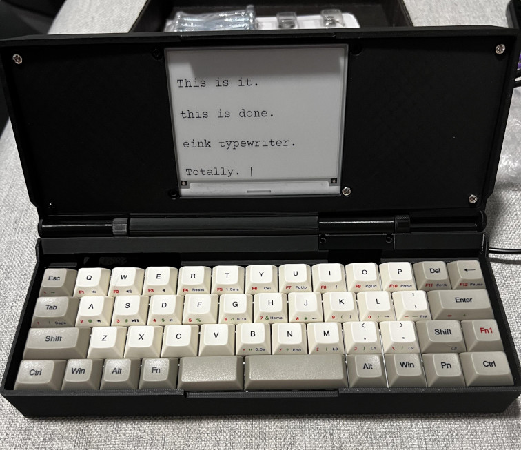](/images/diy/ZeroWriter.jpg) |
| 12/9/2023 | [Writercyber-cyberwriter](https://www.reddit.com/r/writerDeck/comments/18e6wop/writercybercyberwriter/) by u/wabaki- | Hardware: "Raspberyy Pi 3A+, Bigtreetech TFT50"; Software: ???; Case: aluminum HDD enclosure | [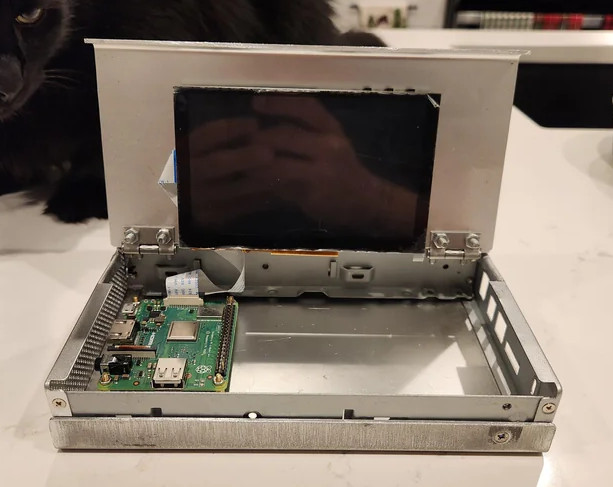](/images/diy/WritercyberCyberwriter.jpg) |
| 7/26/2023 | [Mythic II](https://www.reddit.com/r/writerDeck/comments/15akhwr/a_friend_wanted_a_beautiful_serene_computer_he/) by u/Yungblude | Hardware: Intel NUC?; Software: ???; Case: "wood, leather" | [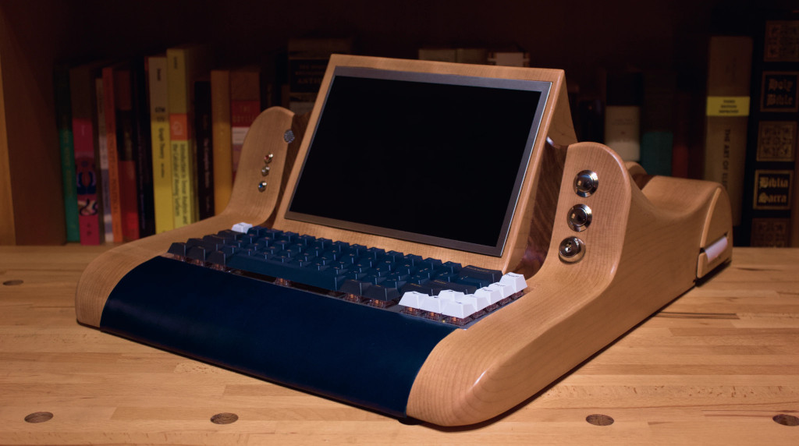](/images/diy/MythicII.jpg) |
| 5/18/2023 | [MUSE](https://www.reddit.com/r/writerDeck/comments/13l0zmx/finally_finished_my_writerdeck_i_call_it_the_muse/) by u/ThisIsTheNewSleeve | Hardware: "Raspberry Pi 4, 68 Keys open source keyboard"; Software: "Raspberry Pi OS, Google Docs"; Case: 3D printed | [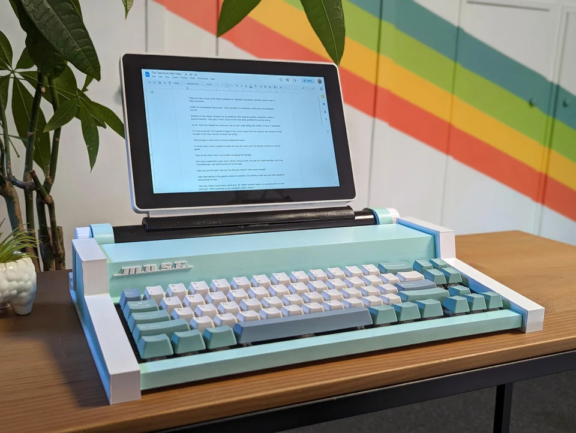](/images/diy/Muse.jpg) |
| 5/14/2023 | [ClipboardPi](https://www.reddit.com/r/writerDeck/comments/13hw5vw/the_clipboardpi/) by u/CrazyinFrance | Hardware: Raspberry Pi 400; Software: Raspberry Pi OS; Case: a clipboard | [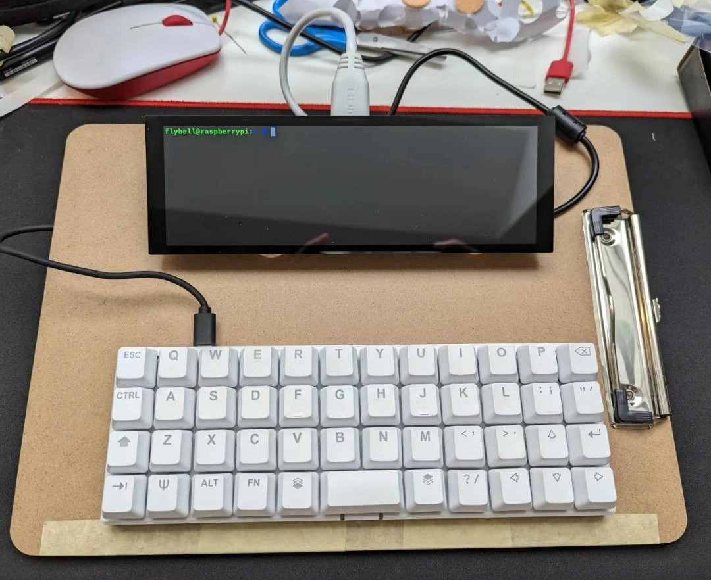](/images/diy/ClipBoardDeck.jpg) |
| 4/18/2023 | [mac air top deck](https://www.reddit.com/r/writerDeck/comments/12rf3i5/the_new_deck_made_with_a_mac_air_top_case_as_the/) by u/DreaminginDarkness | Hardware: "Raspberry Pi, Waveshare touchscreen"; Software: "FocusWriter, rclone, rclonesync"; Case: Mac air top case | [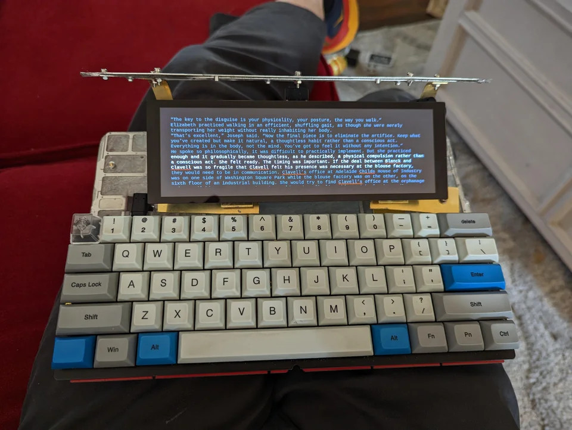](/images/diy/MacAirTopDeck.jpg) |
| 3/29/2023 | [Mythic I](https://www.reddit.com/r/writerDeck/comments/125wqf4/i_wanted_a_beautiful_computer_and_couldnt_find/) by u/Yungblude | Hardware: Intel NUC; Software: "NixOS, bash, wordgrinder, kakoune"; Case: "maple, walnut, leather" | [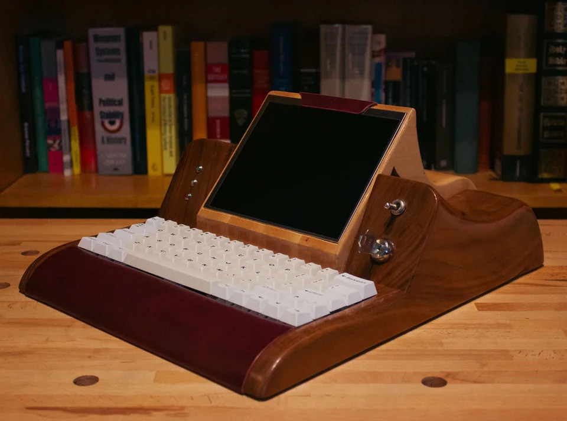](/images/diy/MythicI.jpg) |
| 3/21/2023 | [Compass Set Deck](https://www.reddit.com/r/writerDeck/comments/11y4wpx/update/) by u/DreaminginDarkness | Hardware: "Raspberry Pi, Waveshare LCD, Vortex core 40% mech keyboard"; Software: "FocusWriter, rclone, rclonesync"; Case: Compass lettering set case | [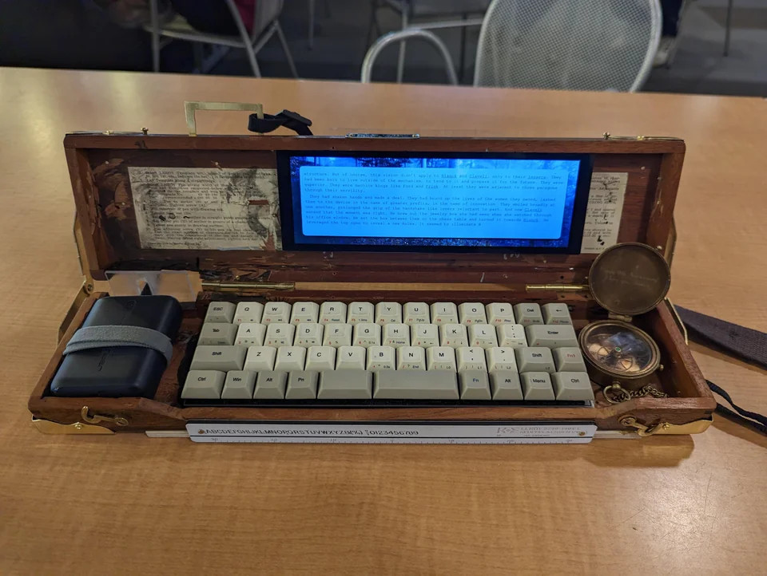](/images/diy/CompassSetDeck.jpg) |
| 6/14/2022 | [WareWoolf Alpha](https://benjaminsloan.com/2022/06/14/warewoolf-alpha-a-single-purpose-writing-device-i-built/) by Benjamin Sloan | Hardware: Raspberry Pi 4; Software: "Raspberry Pi OS Lite, WareWoolf original open software"; Case: "oak, copper, plastic, cork" | [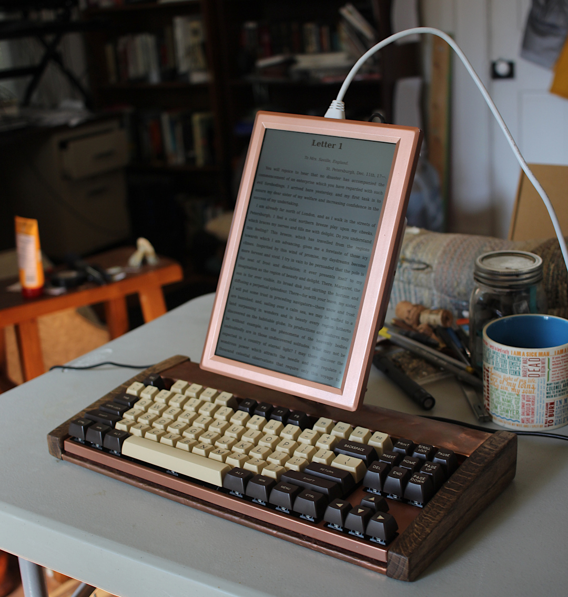](/images/diy/WareWoolfAlpha.jpg) |
| 10/24/2021 | [square-screened lego deck](https://www.reddit.com/r/cyberDeck/comments/qf7zrh/i_use_this_for_writing_and_everything_autosyncs/) by u/DreaminginDarkness | Hardware: "Raspberry Pi 4, Hyperpixedl square touch screen"; Software: "Linux, FocusWriter"; Case: cardboard and lego blocks | [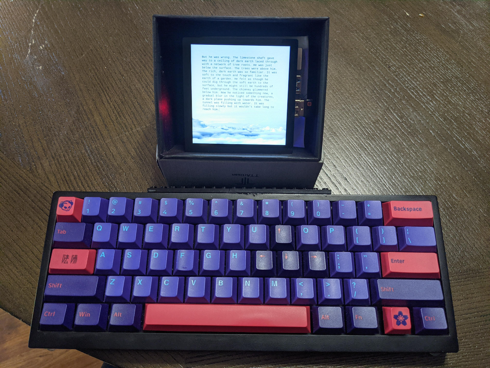](/images/diy/SquareScreenLegoDeck.jpg) |
| 7/7/2021 | [LCDTyper](http://www.larsby.com/johan/2021/07/lcdtyper/) by John Larsby | Hardware: "Raspberry Pi Zero, GeekPiLCD"; Software: "Linux, Kilo"; Case: wood | [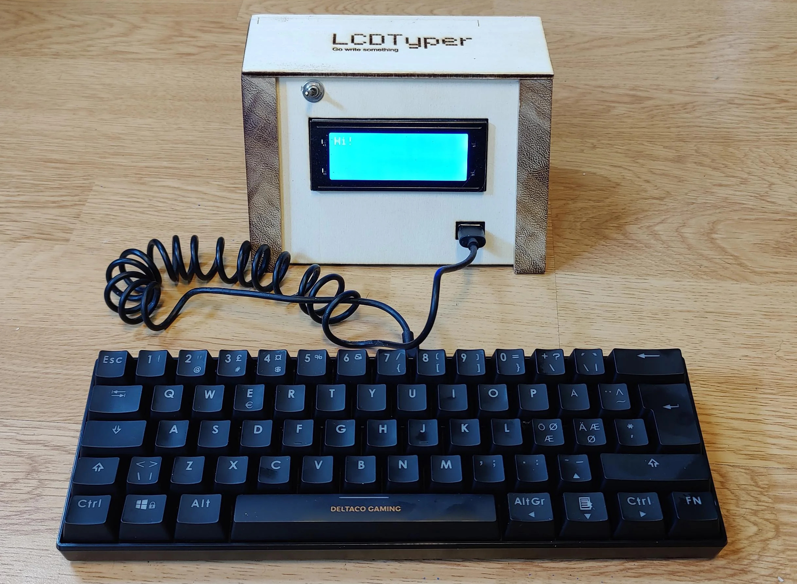](/images/diy/LCDTyper.jpg) |
| 6/5/2021 | [Papertyper](http://www.larsby.com/johan/2021/06/papertyper-digital-typewriter-4/) by John Larsby | Hardware: "Raspberry Pi Zero, Waveshare LCD"; Software: "Linux, Micro"; Case: wood | [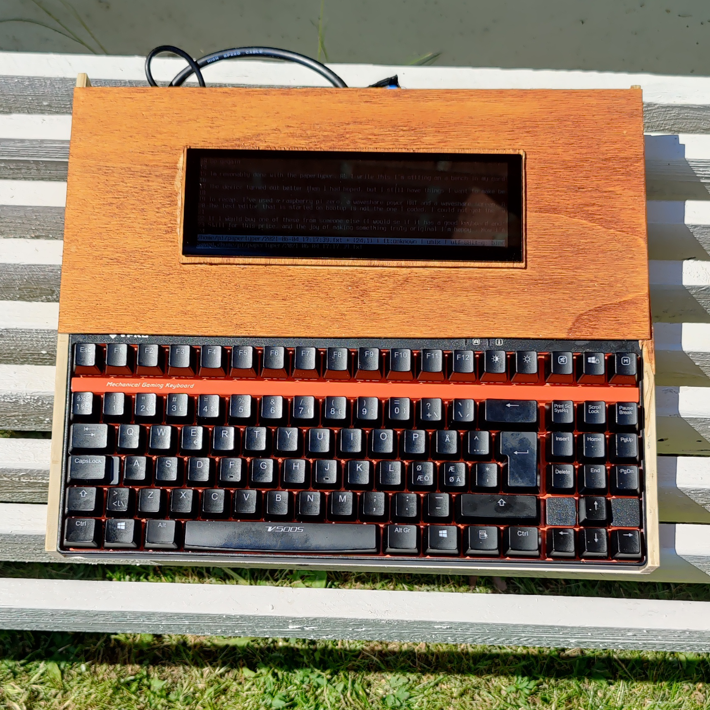](/images/diy/PaperTyper.jpg) |
| 12/14/2020 | [FeatherQuill](https://www.instructables.com/FeatherQuill-34-Hours-of-Distraction-Free-Writing/) by CameronCoward | Hardware: "Raspberry Pi Zero W, ELECTROW 5 Inch touch screen"; Software: "DietPi, WordGrinder"; Case: 3D printed | [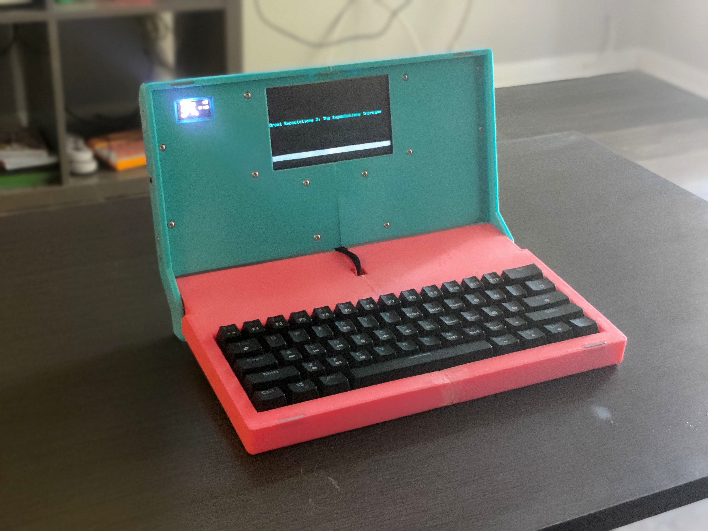](/images/diy/FeatherQuill.jpg) |
| 3/22/2019 | [SPUDwrite](https://spectrum.ieee.org/write-without-distraction-with-this-diy-eink-typewriter) by Lucian Copeland | Hardware: "STMicroelectronics Cortex-M4 processor, E-ink, LCD, thermal printer"; Software: "Software: Mbed firmware, custom Arduino code"; Case: wood | [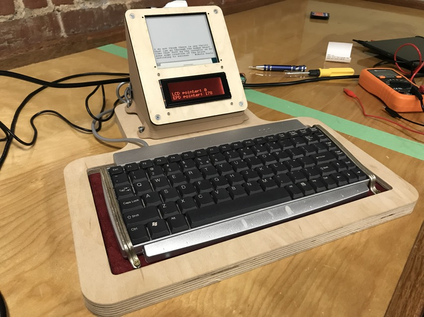](/images/diy/SPUDwrite.jpg) |
| 1/30/2018 | [Ultimate Writer](https://github.com/picnoir/ultimate-writer) by NinjaTrappeur | Hardware: "Raspberry PI 3B, Waveshare E-ink"; Software: "Raspian, Ultimate Writer open software"; Case: wood | [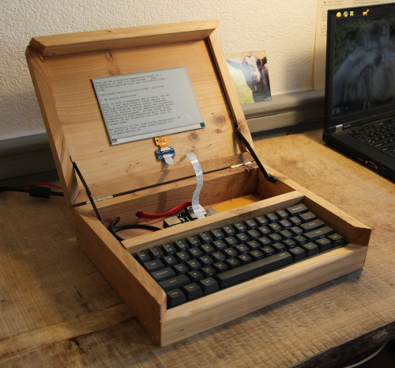](/images/diy/UltimateWriter.jpg)

## Setups For Using Phones/Tablets As WriterDecks

For tablet decks, phone decks, and other almost-WriterDecks, please see this list [here](/list-of-tablet-writerdecks.md).
